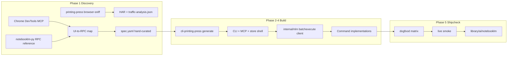
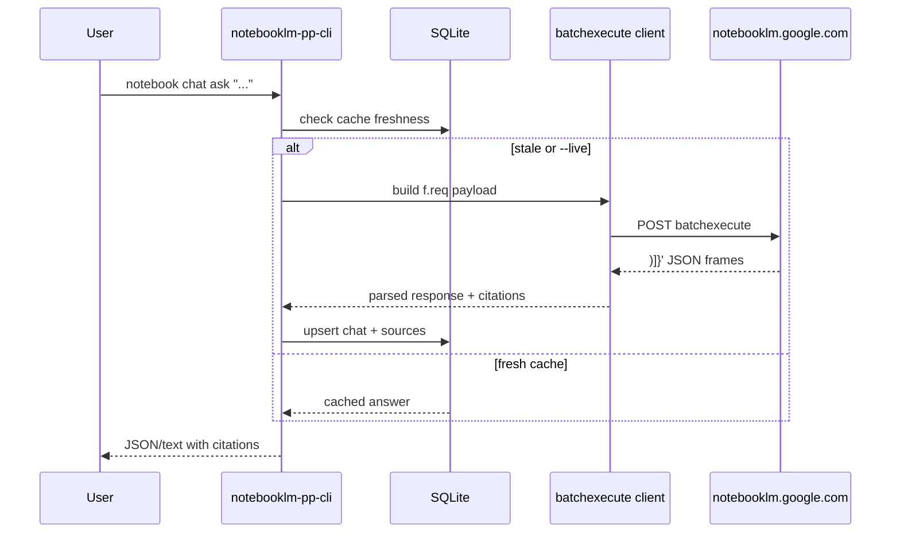

# feat: NotebookLM CLI via Printing Press — full notebooklm-py parity

## Summary

Build `notebooklm-pp-cli` — a Go CLI (plus MCP server) for [Gemini Notebook](https://notebooklm.google.com/) using `/printing-press`. Discovery uses browser-sniff of Google's internal `batchexecute` RPC surface, Chrome cookie auth, and replayable HTTP transport. v1 targets **full parity** with [notebooklm-py](https://github.com/teng-lin/notebooklm-py): notebooks, sources, chat, notes, research agents, sharing, all Studio artifact types with download/export, SQLite offline store, and agent-native JSON + MCP surfaces.

---

## Problem Frame

Gemini Notebook (formerly NotebookLM) has no official public API. Power users and agents rely on undocumented internal RPCs. The dominant community client is `notebooklm-py` (Python, MCP, REST server) — mature, feature-rich, but not a Printing Press Go CLI with the library's agent conventions (`--json`, `doctor`, SQLite cache, `SKILL.md`, Steinberger scoring).

Chrome DevTools study (2026-07-21) confirms:

- **Home UI**: filter tabs (All / My notebooks / Featured), search, grid/list toggle, sort, create notebook, featured + recent lists.
- **Notebook UI**: three-panel layout — **Sources** (add, discover with Web/Fast Research, sort, select), **Chat** (configure, history, query), **Studio** (Audio, Slide Deck, Video, Mind Map, Reports, Flashcards, Quiz, Infographic, Data Table, notes).
- **API transport**: `POST https://notebooklm.google.com/_/LabsTailwindUi/data/batchexecute` with `rpcids`, `bl`, `f.sid`, `source-path`, `f.req` body, `at` CSRF token; responses prefixed with `)]}'` (Google XSSI). Observed RPC IDs on notebook load: `rLM1Ne`, `hPTbtc`, `JFMDGd`, `sqTeoe`, `I3xc3c`, `e3bVqc`, `gArtLc`, `tr032e`, `VfAZjd`, `cFji9`, `ozz5Z`, `khqZz`, `wXbhsf`. Long-poll channel via `signaler-pa.clients6.google.com` for async artifact status.

The Printing Press can generate a scaffold, but Google batchexecute complexity (like `google-trends`) requires substantial hand-authored RPC client code post-generation.

---

## Requirements

### Notebooks & identity

- R1. CLI lists, creates, renames, and deletes notebooks for the authenticated Google account.
- R2. CLI resolves notebook by ID or title (fuzzy match with disambiguation error).
- R3. `whoami` reports account identity and subscription tier hints when the RPC exposes them.

### Sources

- R4. CLI adds sources via URL, pasted text, file upload, YouTube, and Google Drive references.
- R5. CLI lists, gets, refreshes, and deletes sources within a notebook.
- R6. CLI supports source discovery/research flows (Web and Fast Research modes) with import-on-complete.
- R7. CLI manages source labels (list, add, remove, filter by label).

### Chat & notes

- R8. CLI sends chat queries with optional source selection scope and returns cited answers (`--json`).
- R9. CLI reads conversation history and supports custom personas / configure-notebook options exposed by RPC.
- R10. CLI creates, lists, renames, deletes notes; saves chat answers and conversation history as notes.

### Studio artifacts

- R11. CLI triggers generation for all Studio types: audio, video, slide deck, mind map, report, flashcards, quiz, infographic, data table.
- R12. CLI polls artifact status and downloads outputs (MP3, MP4, PDF, PPTX, PNG, CSV, JSON, Markdown as applicable).
- R13. CLI supports batch download (`download <type> --all`) and artifact-specific options (format, length, language, prompt).

### Sharing & research

- R14. CLI manages sharing: public/private links, viewer/editor permissions, view level.
- R15. CLI runs research agents (fast/deep, web/drive) with structured status output.

### Agent surfaces

- R16. Every command supports `--json` with stable schemas and machine-readable errors.
- R17. MCP server (`notebooklm-pp-mcp`) exposes intent-shaped tools matching CLI capabilities.
- R18. `doctor --json` validates auth, RPC reachability, and names known breakage risks.

### Local store

- R19. SQLite store caches notebooks, sources metadata, chat history, artifact catalog, and supports FTS search across cached content.
- R20. `sync` command refreshes local cache from live RPC with cursor/timestamp tracking.

### Auth & transport

- R21. `auth login --chrome` imports `.google.com` session cookies; doctor detects expired sessions with remediation hints.
- R22. HTTP client replays batchexecute without a resident browser sidecar (Surf/browser-chrome transport as probe dictates).
- R23. README and SKILL.md document unofficial-API risk, ToS caveats, and personal-use framing.

---

## Key Technical Decisions

- KTD1: **Printing Press as generator, not notebooklm-py as runtime dependency.** Use `/printing-press notebooklm` with `BROWSER_SNIFF_TARGET_URL=https://notebooklm.google.com`. notebooklm-py is the **parity checklist and RPC reference**, not a subprocess wrapper. Rationale: Steinberger scoring, Go binary distribution, library conventions.

- KTD2: **Primary transport = Google batchexecute RPC client in Go.** Hand-authored `internal/nlm/rpc.go` mirroring patterns in `library/marketing/google-trends/internal/gtrends/trending.go`. Spec YAML documents RPC IDs and payload shapes; generator scaffold provides CLI/MCP/store shell only. Rationale: mechanical sniff mis-infers batchexecute; community clients prove RPC stability is manageable but not auto-generatable.

- KTD3: **Auth = Chrome cookie import for `.google.com`.** Reuse patterns from `library/marketing/google-trends/internal/cli/auth.go` and `library/sales-and-crm/contact-goat/internal/chromecookies/`. No OAuth desktop flow (no official API). Rationale: UI requires Google account session; MFA handled by user's real Chrome login.

- KTD4: **Async artifacts via signaler long-poll + status RPC.** Studio generation (audio, video, slides) is not synchronous HTTP; poll `signaler-pa.clients6.google.com` channel and/or status RPCs (`wXbhsf`, `cFji9` candidates) with timeout and `--wait` flag. Rationale: observed network traffic on artifact-heavy notebook.

- KTD5: **Slug `notebooklm`, binary `notebooklm-pp-cli`.** Keep discoverability despite July 2026 Gemini Notebook rebrand; display name "Gemini Notebook" in README. Rationale: user selected notebooklm branding; registry/search alignment.

- KTD6: **MCP server ships in v1.** Full parity with notebooklm-py includes MCP; generate `cmd/notebooklm-pp-mcp/` alongside CLI. Rationale: user confirmed full parity scope.

- KTD7: **REST server deferred.** notebooklm-py's REST server is a convenience wrapper; MCP + CLI cover agent use cases. Rationale: scope control without sacrificing stated parity on core capabilities agents need.

- KTD8: **Chrome DevTools MCP supplements printing-press browser-sniff.** Use chrome-devtools during discovery to map UI→RPC correlations (which button triggers which `rpcids`). Artifacts go to run manuscripts, not committed. Rationale: user explicitly authorized DevTools study.

---

## Scope Boundaries

### In scope

- Full `/printing-press` run from preflight through shipcheck and library publish at `library/ai/notebooklm/`
- All R1–R23 requirements
- Live smoke tests against a logged-in Google account (read-only where possible; create/delete in ephemeral test notebook)

### Deferred to Follow-Up Work

- REST HTTP server (notebooklm-py parity gap accepted per KTD7)
- 2026 agentic beta features not yet in notebooklm-py (source discovery chat, in-notebook code execution, new export formats) — track upstream
- `gemini-notebook` slug alias command namespace
- Public library publish PR (separate from local library install)

### Outside this product's identity

- Official Google API client (does not exist)
- Resident browser sidecar transport
- Google Drive file upload implementation beyond URL/Drive-reference RPC delegation

---

## High-Level Technical Design

### Discovery → spec → generate → hand-build



### Runtime request flow



### UI surface map (Chrome DevTools validated)

| UI region | Primary user actions | RPC mapping status |
|-----------|---------------------|-------------------|
| Home | list/create/filter notebooks | Discover via list/create flows |
| Sources panel | add, discover, sort, select | `rLM1Ne` loads notebook+sources on open |
| Chat panel | query, configure, history | Map during chat capture session |
| Studio panel | generate artifacts, download | Map per artifact type + poll channel |
| Share/Settings | permissions, preferences | Map during share flow capture |

---

## System-Wide Impact

- **Library**: New entry at `library/ai/notebooklm/` plus `registry.json` update on publish
- **Agents**: New `SKILL.md` and `AGENTS.md` for NotebookLM automation
- **Auth**: User must maintain Google session; cookies are sensitive — never commit, scan in Phase 5.6 archive
- **Competition**: Does not replace notebooklm-py; offers Go/agent-library alternative

---

## Risks & Dependencies

| Risk | Severity | Mitigation |
|------|----------|------------|
| Google changes `bl`/`rpcids`/payload shapes | High | Versioned RPC module; doctor smoke test; document breakage in README |
| Session expiry / MFA | Medium | `auth login --chrome`; doctor `refresh_expired` hints |
| ToS / unofficial API | Medium | Personal-use README framing; no Google affiliation claims |
| Sniff mis-inference | High | Hand-curate spec; validate cookie replay before ship |
| Artifact poll timeouts | Medium | `--wait` with configurable timeout; partial status in `--json` |
| Rate limiting | Medium | Adaptive backoff; batch commands document limits |
| Full parity scope creep | Medium | Track notebooklm-py feature matrix in absorb manifest; ship only manifest-approved rows |

**Dependencies:** `cli-printing-press` v4+, Go 1.26+, logged-in Chrome session, `notebooklm-py` repo for RPC cross-reference (read-only).

---

## Phased Delivery

| Phase | Units | Outcome |
|-------|-------|---------|
| 1 — Discovery | U1–U3 | Research brief, gate markers, hand-curated spec |
| 2 — Scaffold | U4–U6 | Generated CLI shell + auth + RPC client |
| 3 — Core commands | U7–U11 | Notebooks, sources, chat, studio, sharing |
| 4 — Agent layer | U12–U13 | SQLite sync + MCP server |
| 5 — Ship | U14 | Dogfood, live smoke, library publish |

---

## Implementation Units

### U1. Printing Press run initialization

**Goal:** Start a managed `/printing-press notebooklm` run with correct gates and auth posture.

**Requirements:** R21, R23

**Dependencies:** None

**Files:**
- `$PRESS_RUNSTATE/runs/<run-id>/state.json`
- `$PRESS_RUNSTATE/runs/<run-id>/browser-browser-sniff-gate.json`
- `$PRESS_RUNSTATE/runs/<run-id>/source-priority.json` (single source)

**Approach:**
- Run printing-press preflight; capture `PRINTING_PRESS_BIN`
- Briefing: user wants full parity; set `BROWSER_SNIFF_TARGET_URL=https://notebooklm.google.com` (website-itself path)
- Phase 0.5 API key gate: skip (Google session auth, not API key)
- Phase 1.6: confirm user logged into NotebookLM in Chrome (`AUTH_SESSION_AVAILABLE=true`)
- Phase 1.7: write gate marker `decision: pre-approved` for website-itself choice
- Public-library check: no existing `notebooklm` entry — proceed
- Initialize run dirs per skill (`research/`, `discovery/`, `pipeline/`, `working/notebooklm-pp-cli/`)

**Patterns to follow:** `~/.claude/skills/printing-press/SKILL.md` Run Initialization

**Test scenarios:**
- Happy path: preflight succeeds, `state.json` contains `api_name: notebooklm`, gate file has `asked_at` timestamp
- Error path: preflight fails without `cli-printing-press` — abort with install instructions

**Verification:** `state.json` and gate marker exist; `PRINTING_PRESS_BIN` resolves.

---

### U2. Browser discovery and RPC mapping

**Goal:** Capture NotebookLM traffic and produce UI-to-RPC correlation map.

**Requirements:** R22 (transport discovery)

**Dependencies:** U1

**Files:**
- `$API_RUN_DIR/discovery/traffic-analysis.json`
- `$API_RUN_DIR/discovery/ui-rpc-map.md`
- `$API_RUN_DIR/discovery/browser-sniff-report.md`
- `$RESEARCH_DIR/<stamp>-browser-sniff-spec.yaml` (draft)

**Approach:**
- Run `probe-reachability https://notebooklm.google.com --json`; record mode in brief
- Run `cli-printing-press browser-sniff` with logged-in session against home + notebook flows:
  - List notebooks (home)
  - Open notebook (sources load)
  - Add source (URL paste)
  - Chat query
  - Trigger one lightweight artifact (e.g., quiz) and capture poll traffic
  - Open share dialog
- **Chrome DevTools MCP** parallel capture: snapshot UI labels, `list_network_requests` for `fetch`/`xhr`, `get_network_request` for batchexecute bodies
- Cross-reference RPC IDs with notebooklm-py source (read-only) to name operations
- Filter Google chrome noise (analytics, play.google.com/log)
- Write `ui-rpc-map.md` table: UI action → rpcids → notes

**Execution note:** Capture sessions must strip cookie values from all artifacts per secret-protection rules.

**Patterns to follow:** `library/marketing/google-trends/.manuscripts/*/research/browser-sniff-report.md`, `references/browser-sniff-capture.md`

**Test scenarios:**
- Happy path: at least 10 distinct `rpcids` mapped to UI actions
- Edge case: signaler long-poll requests captured for artifact flow
- Error path: if sniff fails 3 min, fall back to manual HAR from DevTools export — do not pivot scope without user consent

**Verification:** `traffic-analysis.json` and `ui-rpc-map.md` exist with batchexecute endpoint documented.

---

### U3. Research brief and absorb manifest

**Goal:** Single build-driving brief and feature manifest targeting notebooklm-py parity.

**Requirements:** R1–R23 (traceability)

**Dependencies:** U2

**Files:**
- `$RESEARCH_DIR/<stamp>-feat-notebooklm-pp-cli-brief.md`
- `$RESEARCH_DIR/<stamp>-feat-notebooklm-pp-cli-absorb-manifest.md`

**Approach:**
- Brief sections: API Identity, Reachability Risk, Top Workflows, Table Stakes (from notebooklm-py + cola-runner/notebooklm-cli), Data Layer, Product Thesis, Source Priority, Build Priorities
- Table stakes sourced from notebooklm-py README feature matrix
- Absorb manifest rows: each notebooklm-py capability → CLI command → priority (ship/v0.2) → evidence
- Phase 1.5 absorb gate: user approves manifest (full parity = all rows ship unless technically blocked)
- Self-brainstorm: novel features beyond notebooklm-py (offline FTS, `doctor` RPC probe, Steinberger agent hints)

**Patterns to follow:** `library/marketing/google-trends/` research artifacts

**Test scenarios:**
- Happy path: manifest has rows for all artifact types in notebooklm-py table
- Edge case: rows marked `blocked` include explicit reason and doctor hint

**Verification:** User approves manifest; brief lists reachability tier from U2 probe.

---

### U4. Hand-curated spec and generator run

**Goal:** Produce `spec.yaml` and run `cli-printing-press generate`.

**Requirements:** R22

**Dependencies:** U3

**Files:**
- `library/ai/notebooklm/spec.yaml` (evolves in working dir first)
- `$CLI_WORK_DIR/` (generated module)
- `$API_RUN_DIR/pipeline/generate-log.txt`

**Approach:**
- Hand-curate spec from U2 draft:
  - `name: notebooklm`, `base_url: https://notebooklm.google.com`, `spec_source: sniffed`
  - `http_transport: browser-chrome` (if probe says `browser_http` or `browser_clearance_http`)
  - `auth.type: cookie`, `cookie_domain: .google.com`, cookies: `SID`, `__Secure-1PSID`, `SAPISID`, `OSID`, etc.
  - `resources` for notebooks, sources, chat, artifacts — RPC-shaped endpoints referencing `batchexecute` with `rpcids` param
- Run `cli-printing-press generate --spec <spec> --name notebooklm`
- Expect scaffold only for RPC resources — flag Priority 0 hand-written commands in manifest

**Patterns to follow:** `library/marketing/google-trends/spec.yaml`

**Test scenarios:**
- Happy path: `go build ./...` passes in generated module
- Error path: spec validation fails — fix spec, regen (max 2 verify loops)

**Verification:** Generated `cmd/notebooklm-pp-cli/main.go` exists; build green.

---

### U5. Auth and session management

**Goal:** Implement `auth login --chrome`, `auth status`, cookie refresh hints.

**Requirements:** R21, R18

**Dependencies:** U4

**Files:**
- `library/ai/notebooklm/internal/cli/auth.go`
- `library/ai/notebooklm/internal/cli/auth_test.go`
- `library/ai/notebooklm/internal/auth/session.go`
- `library/ai/notebooklm/internal/chromecookies/` (copy/adapt from contact-goat)

**Approach:**
- `auth login --chrome` extracts `.google.com` cookies from Chrome profile
- `auth status --json` reports cookie presence, expiry hints, account email if derivable
- Wire auth into HTTP transport for all RPC calls
- Doctor checks: missing cookies → actionable error with `auth login --chrome` hint

**Patterns to follow:** `library/marketing/google-trends/internal/cli/auth.go`, `library/sales-and-crm/contact-goat/internal/chromecookies/`

**Test scenarios:**
- Happy path: with mock cookie file, auth status returns `authenticated: true`
- Error path: no cookies → status returns `authenticated: false` and remediation command
- Edge case: expired `SIDCC` → doctor flags `session_stale`

**Verification:** `auth status --json` succeeds after Chrome login on dev machine.

---

### U6. Batchexecute RPC client

**Goal:** Core RPC layer encoding/decoding Google's batchexecute protocol.

**Requirements:** R22

**Dependencies:** U4, U5

**Files:**
- `library/ai/notebooklm/internal/nlm/rpc.go`
- `library/ai/notebooklm/internal/nlm/rpc_test.go`
- `library/ai/notebooklm/internal/nlm/decode.go`
- `library/ai/notebooklm/internal/nlm/poll.go`
- `library/ai/notebooklm/internal/nlm/fixtures/` (recorded responses, no cookies)

**Approach:**
- Implement: build `f.req` array, attach `at` token (from initial page load or prior response), POST to `/_/LabsTailwindUi/data/batchexecute`
- Strip `)]}'` prefix; parse `wrb.fr` frames
- Track `bl`, `f.sid`, `_reqid` sequencing per session
- `poll.go`: signaler channel watch for artifact completion
- Table-driven tests from sanitized fixtures captured in U2

**Technical design (directional):**
```
RPCCall(ctx, rpcid, payload) → ([]Frame, error)
PollArtifact(ctx, notebookID, artifactID, timeout) → (status, downloadURL, error)
```

**Patterns to follow:** `library/marketing/google-trends/internal/gtrends/trending.go`

**Test scenarios:**
- Happy path: decode fixture from `rLM1Ne` notebook load response
- Error path: malformed frame → wrapped error with rpcid name
- Edge case: empty notebook → valid empty sources array
- Integration: live call `RPCCall` for list notebooks (requires auth, tagged `integration`)

**Verification:** Unit tests pass; one live integration test lists ≥1 notebook.

---

### U7. Notebooks commands

**Goal:** CRUD commands for notebooks.

**Requirements:** R1, R2, R3, R16

**Dependencies:** U6

**Files:**
- `library/ai/notebooklm/internal/cli/notebooks.go`
- `library/ai/notebooklm/internal/cli/notebooks_test.go`
- `library/ai/notebooklm/internal/cli/whoami.go`

**Approach:**
- Commands: `notebook list`, `notebook create`, `notebook get`, `notebook rename`, `notebook delete`, `whoami`
- `--json` output: `{id, title, emoji, source_count, updated_at}`
- Title lookup with disambiguation when multiple matches

**Test scenarios:**
- Happy path: `notebook list --json` returns array
- Happy path: `notebook create "test-plan-<uuid>"` then `notebook delete`
- Error path: `notebook get nonexistent` → exit 1, machine-readable error
- Edge case: rename to empty string rejected

**Verification:** Dogfood matrix covers all notebook subcommands + `--json`.

---

### U8. Sources commands

**Goal:** Source management and research import.

**Requirements:** R4, R5, R6, R7, R16

**Dependencies:** U7

**Files:**
- `library/ai/notebooklm/internal/cli/sources.go`
- `library/ai/notebooklm/internal/cli/sources_test.go`
- `library/ai/notebooklm/internal/cli/source_labels.go`
- `library/ai/notebooklm/internal/cli/research.go`

**Approach:**
- `source add url|text|file|youtube|drive`, `source list`, `source get`, `source refresh`, `source delete`
- `source add-research "<query>" --mode fast|deep --import`
- `source label list|add|remove|filter`
- File upload: multipart if RPC requires; else URL-based ingestion

**Test scenarios:**
- Happy path: add URL source to test notebook, list shows it
- Happy path: `source add-research` returns job ID and completes with `--wait`
- Error path: invalid URL format rejected before RPC
- Integration: add + delete source in ephemeral notebook

**Verification:** Live smoke adds and removes a `example.com` URL source.

---

### U9. Chat and notes commands

**Goal:** Conversational query and note management.

**Requirements:** R8, R9, R10, R16

**Dependencies:** U8

**Files:**
- `library/ai/notebooklm/internal/cli/chat.go`
- `library/ai/notebooklm/internal/cli/chat_test.go`
- `library/ai/notebooklm/internal/cli/notes.go`
- `library/ai/notebooklm/internal/cli/notes_test.go`
- `library/ai/notebooklm/internal/cli/persona.go`

**Approach:**
- `chat ask "<question>" [--sources id1,id2] [--json]`
- `chat history list`, `chat configure` (persona/settings)
- `note list|create|rename|delete`, `note save-answer`, `note save-conversation`
- JSON includes `citations[]` with source references when RPC provides them

**Test scenarios:**
- Happy path: `chat ask` returns answer + citations against notebook with sources
- Happy path: `note save-answer` persists after ask
- Error path: ask on empty notebook returns clear error
- Edge case: `--sources` with invalid ID rejected

**Verification:** Live smoke asks one question in test notebook; citations array non-empty when sources exist.

---

### U10. Studio artifact commands

**Goal:** Generate, poll, and download all Studio artifact types.

**Requirements:** R11, R12, R13, R16

**Dependencies:** U9

**Files:**
- `library/ai/notebooklm/internal/cli/studio.go`
- `library/ai/notebooklm/internal/cli/studio_test.go`
- `library/ai/notebooklm/internal/cli/generate.go`
- `library/ai/notebooklm/internal/cli/download.go`
- `library/ai/notebooklm/internal/nlm/artifacts.go`

**Approach:**
- `generate audio|video|slides|mindmap|report|flashcards|quiz|infographic|datatable` with type-specific flags (--format, --length, --language, --prompt, --wait)
- `generate status <artifact-id>`, `download <type> <artifact-id> [file]`, `download <type> --all`
- Map each to RPC + poll loop from U6
- Honor notebooklm-py option matrix (audio formats, video styles, slide formats, etc.)

**Test scenarios:**
- Happy path: `generate quiz --wait` completes with artifact ID
- Happy path: `download quiz <id> out.json` writes valid JSON
- Error path: poll timeout returns exit code 2 with `timed_out: true` in JSON
- Edge case: `download --all` with zero artifacts returns empty array, exit 0

**Verification:** Live smoke generates quiz (fastest artifact) and downloads JSON.

---

### U11. Sharing commands

**Goal:** Notebook sharing and permissions.

**Requirements:** R14, R16

**Dependencies:** U7

**Files:**
- `library/ai/notebooklm/internal/cli/share.go`
- `library/ai/notebooklm/internal/cli/share_test.go`

**Approach:**
- `share status`, `share public on|off`, `share add <email> --role viewer|editor`, `share remove <email>`
- Read-only smoke default; mutating share tests only on ephemeral notebook

**Test scenarios:**
- Happy path: `share status --json` on test notebook
- Error path: invalid email rejected
- Integration: `share public on` then `share public off` on ephemeral notebook

**Verification:** Share status returns JSON without error on test notebook.

---

### U12. SQLite store and sync

**Goal:** Offline cache, FTS search, sync command.

**Requirements:** R19, R20

**Dependencies:** U7, U8, U9, U10

**Files:**
- `library/ai/notebooklm/internal/store/store.go`
- `library/ai/notebooklm/internal/store/schema.sql`
- `library/ai/notebooklm/internal/store/fts.go`
- `library/ai/notebooklm/internal/cli/sync.go`
- `library/ai/notebooklm/internal/cli/search.go`
- `library/ai/notebooklm/internal/cli/*_test.go`

**Approach:**
- Tables: notebooks, sources, chats, messages, artifacts, notes, sync_cursors
- FTS5 on source titles, chat content, note bodies
- `sync` pulls incremental updates; read commands check freshness per resource type
- `search "<query>"` queries local FTS

**Patterns to follow:** Generated store patterns from printing-press; `docs/solutions/devx/full-text-fanout-partial-failures.md` for partial sync

**Test scenarios:**
- Happy path: sync then search finds known string from test notebook
- Edge case: partial sync failure reports warnings in `--json`, exit 0
- Error path: corrupt DB → doctor recommends reset path

**Verification:** `sync` + `search` integration test passes.

---

### U13. MCP server

**Goal:** Intent-shaped MCP tools for agent access.

**Requirements:** R17, R16

**Dependencies:** U7–U12

**Files:**
- `library/ai/notebooklm/cmd/notebooklm-pp-mcp/main.go`
- `library/ai/notebooklm/internal/mcp/server.go`
- `library/ai/notebooklm/internal/mcp/tools.go`
- `library/ai/notebooklm/internal/mcp/server_test.go`

**Approach:**
- Tools map to high-value intents: `list_notebooks`, `create_notebook`, `add_source`, `ask_question`, `generate_artifact`, `download_artifact`, `search_notebooks`
- stdio transport; `--json` schemas match CLI
- Regenerate tool list in shipcheck

**Patterns to follow:** Other `*-pp-mcp` binaries in library

**Test scenarios:**
- Happy path: MCP `list_notebooks` returns same data as CLI
- Error path: unauthenticated call returns structured MCP error

**Verification:** `go test ./internal/mcp/...` passes; manual MCP smoke lists notebooks.

---

### U14. Doctor, docs, shipcheck, and library publish

**Goal:** Ship a scored, documented CLI to the local library.

**Requirements:** R18, R23

**Dependencies:** U5–U13

**Files:**
- `library/ai/notebooklm/internal/cli/doctor.go`
- `library/ai/notebooklm/README.md`
- `library/ai/notebooklm/SKILL.md`
- `library/ai/notebooklm/AGENTS.md`
- `$PROOFS_DIR/<stamp>-fix-notebooklm-pp-cli-shipcheck.md`
- `$PROOFS_DIR/<stamp>-fix-notebooklm-pp-cli-live-smoke.md`
- `library/ai/notebooklm/.printing-press.json`

**Approach:**
- `doctor --json`: auth, RPC probe, binary age, known limitations from manifest `blocked` rows
- README: install, auth, command cookbook, unofficial API disclaimer, parity matrix vs notebooklm-py
- SKILL.md: agent workflows (research automation, artifact generation, cited Q&A)
- Run shipcheck block: verify, dogfood matrix (every subcommand + `--json`), scorecard
- Live smoke: notebook CRUD, source add, chat ask, quiz generate+download
- Archive manuscripts; secret scan before commit
- Promote to `$PRESS_LIBRARY/notebooklm/`

**Test scenarios:**
- Happy path: verify pass rate ≥95%, Steinberger score documented
- Happy path: live smoke log shows all core flows green
- Error path: doctor detects missing auth before any RPC call

**Verification:** Shipcheck markdown exists; CLI installable from library path; scorecard recorded in manifest.

---

## Acceptance Examples

- AE1. **Authenticated list notebooks**
  - **Given:** valid Chrome-imported Google session
  - **When:** user runs `notebooklm-pp-cli notebook list --json`
  - **Then:** exit 0, JSON array with at least one notebook `{id, title}`

- AE2. **Cited chat answer**
  - **Given:** notebook with ≥1 source
  - **When:** user runs `chat ask "What is the main topic?" --json`
  - **Then:** exit 0, `answer` string and `citations` array present

- AE3. **Generate and download quiz**
  - **Given:** notebook with sources
  - **When:** user runs `generate quiz --wait` then `download quiz <id> out.json`
  - **Then:** exit 0, `out.json` is valid JSON with quiz structure

- AE4. **Expired session remediation**
  - **Given:** no valid cookies
  - **When:** user runs `notebook list`
  - **Then:** exit non-zero, stderr/JSON names `auth login --chrome`

- AE5. **MCP agent list**
  - **Given:** MCP server running with valid auth
  - **When:** agent calls `list_notebooks`
  - **Then:** tool returns same notebook IDs as CLI

---

## Open Questions

- OQ1. **REST server in v1.1?** Deferred per KTD7; revisit if users need HTTP automation without MCP.
- OQ2. **2026 agentic features** (source discovery chat, code execution): track notebooklm-py upstream; add manifest rows when RPC mapping exists.
- OQ3. **File upload RPC shape:** confirm during U2 whether uploads go through batchexecute multipart or separate upload endpoint.

---

## Sources & Research

- Chrome DevTools session 2026-07-21: UI snapshot + batchexecute capture on `notebooklm.google.com`
- [notebooklm-py README](https://github.com/teng-lin/notebooklm-py) — parity feature matrix
- [cola-runner/notebooklm-cli](https://github.com/cola-runner/notebooklm-cli) — agent-first JSON CLI reference
- `library/marketing/google-trends/` — Google batchexecute + cookie auth pattern
- `docs/patterns/authenticated-session-scraping.md` — auth tier guidance
- `docs/solutions/best-practices/instacart-orders-no-clean-graphql-op.md` — fragmented RPC caveat
- Printing Press skill: `~/.claude/skills/printing-press/SKILL.md`
